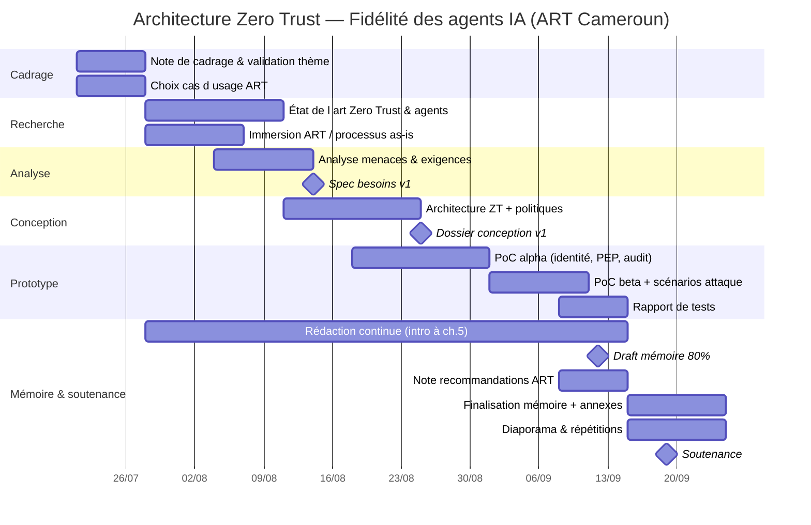

# 5. Diagramme de Gantt — 8 semaines jusqu’à la soutenance

**Hypothèses :**  
- Démarrage = **J0** (début Semaine 1)  
- Soutenance = **J60** (dernier jour Semaine 8)  
- 2 jalons de reporting chaque semaine (mar. / ven.)  
- Chemin critique = Conception → PoC → Tests → Mémoire final → Soutenance  

---

## 5.1 Diagramme de Gantt (Mermaid)



> Les dates ci-dessus partent du **21/07/2026** (référence du jour).  
> Si votre J0 réel diffère, décalez tout le planning de façon identique : **S1…S8 restent la structure à suivre**.

---

## 5.2 Gantt tabulaire (par semaines)

| Tâche | S1 | S2 | S3 | S4 | S5 | S6 | S7 | S8 |
|------|:--:|:--:|:--:|:--:|:--:|:--:|:--:|:--:|
| Validation thème & cas d’usage | ██ | ░░ | | | | | | |
| État de l’art | ░░ | ██ | ██ | ░░ | | | | |
| Analyse ART / menaces / exigences | | ░░ | ██ | ░░ | | | | |
| Conception architecture + politiques | | | ░░ | ██ | ░░ | | | |
| Développement PoC | | | | ░░ | ██ | ██ | ░░ | |
| Tests sécurité / scénarios | | | | | ░░ | ██ | ░░ | |
| Rédaction mémoire | ░░ | ██ | ██ | ██ | ██ | ██ | ██ | ██ |
| Recommandations ART | | | | | | ░░ | ██ | ░░ |
| Diapo + répétition + soutenance | | | | | | | ░░ | ██ |
| Points d’étape mar./ven. | ◆◆ | ◆◆ | ◆◆ | ◆◆ | ◆◆ | ◆◆ | ◆◆ | ◆◆ |

Légende : `██` effort principal · `░░` effort secondaire · `◆` point d’étape

---

## 5.3 Jalons (milestones) à ne pas rater

| Jalon | Quand | Critère de passage |
|-------|------:|--------------------|
| M0 — Thème validé | Fin S1 | Encadreur OK sur intitulé + périmètre |
| M1 — Spec besoins | Fin S3 | Exigences Must listées et testables |
| M2 — Conception gelée | Fin S4 | Diagrammes + ≥5 politiques |
| M3 — PoC beta | Fin S6 | 3 scénarios démontrables |
| M4 — Draft 80 % | Fin S7 | Corps du mémoire relisible |
| M5 — Soutenance | J60 S8 | Pack complet remis + oral |

---

## 5.4 Chemin critique

```text
Validation thème (S1)
    → Exigences & menaces (S3)
        → Architecture (S4)
            → PoC + tests (S5–S6)
                → Mémoire final + diapo (S7–S8)
                    → Soutenance (J60)
```

Toute dérive sur **S4** ou **S5** met la soutenance en danger : si retard conception, réduire le dashboard (ENF Should) mais **ne jamais** sacrifier les 3 scénarios de test ni le chapitre conception.

---

## 5.5 Buffer anti-retard (règles d’or)

1. Si PoC en retard en fin S5 : basculer en **mode mock LLM** immédiatement.  
2. Si rédaction en retard en S6 : bloquer 2 matinées 100 % mémoire.  
3. Ne pas ouvrir de 2ᵉ cas d’usage après S1.  
4. Prévoir **vidéo de démo** dès S6 (plan B soutenance).  
5. Freeze fonctionnalités PoC : **mercredi S8** au plus tard.
